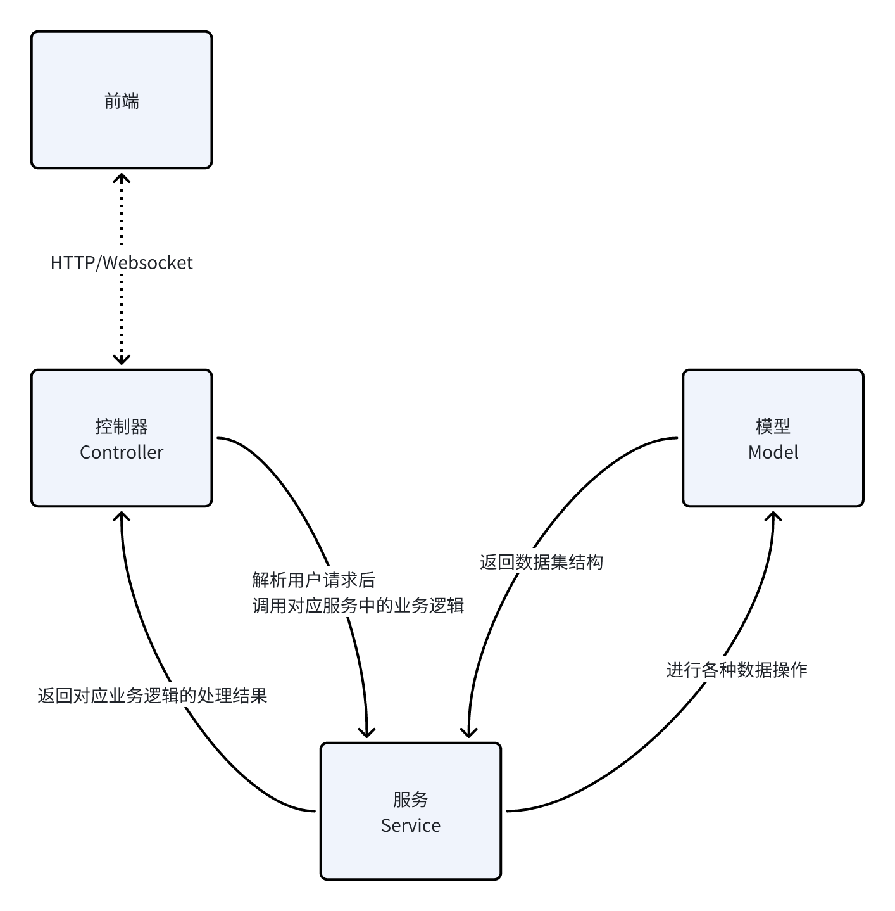
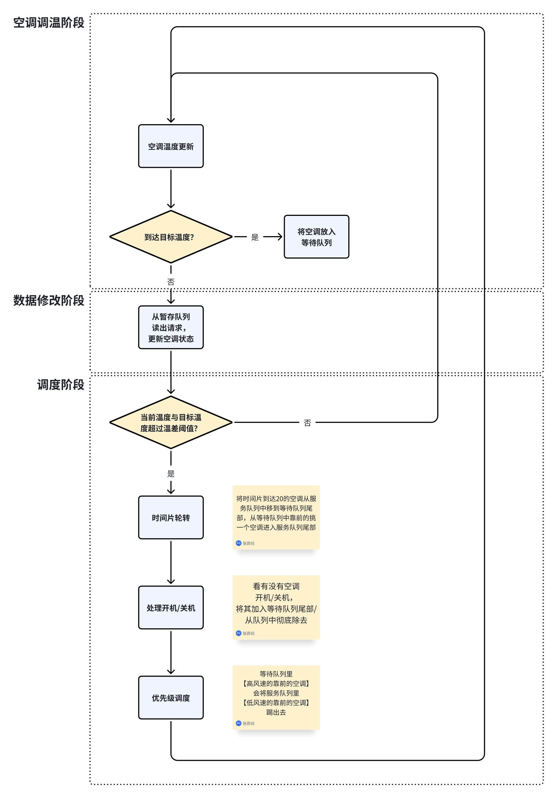

# Martina

北京邮电大学2021级软件工程课程大作业——廉价酒店管理系统。

本次仓库为后端仓库，[前端仓库](https://github.com/post-guard/martina-frontend/tree/master)使用`submodule`链接到本仓库中。

## 需求概述

波普特（BUPT）廉价酒店位于京城五环外的大学城附近，周边环境优美清幽，适合旅游度假放松心情。该酒店成立于 2000 年，经过 10 年的经营积攒了良好的声誉，为了响应政府绿色环保经营的理念，期望构建空调温控计费系统：推崇多用多付出，少用少付出，不用不付 出的计费模式，节省成本的同时使得顾客随时能查看已消费的金额，做到心中有数节省开支的目的，进一步吸引年轻人入住。

- 功能 1：作为顾客，在入住房间后希望酒店提供一个能够操作空调的设备，如空调控制面板或者遥控器，使得顾客能够在需要的时候使用空调：开机、关机、调节温度、调节风速，并能及时查看当前以及累积的空调使用费。
- 功能 2：作为空调管理员，希望具有开机的功能；设置空调工作模式、设置有效的工作温度区间以及设置空调计费费率的功能，以便能够及时有效地提供空调服务。
- 功能 3：作为空调管理员，希望具有关机的功能，以便能够及时检修空调节省能耗。
- 功能 4：作为空调管理员，希望系统提供一个集中监控客房空调运行情况的功能，以便能够及时了解各个客房空调运行的状态：是否开机运行，当前的工作模式、当前室温、目标温度、 风速、当前和累积费用。
- 功能 5：作为前台营业员，希望系统提供一个顾客结账的功能：根据入住时间段，提供空调使用费的账单，方便顾客核对并确认；在顾客需要的前提下也能够提供空调使用的详单。
- 功能 6：作为酒店经理，希望系统提供酒店及各房间空调使用的统计报表：日报、周报。这些报告需要能够全面反应其关心的内容：房间号、开关次数、调度次数、详单条数、调温次数、调风次数、 请求时长、总费用；并希望以折线图或饼图的方式进行展示。

## 系统设计

在系统中，我们前端使用React框架进行开发，后端使用ASP.net Core框架进行开发。在后端的开发过程中使用MVC的典型架构设计进行开发，具体的架构如图所示。



在系统的架构中主要有如下几个部分组成：

- 模型层，是系统架构中的底层，也就是系统中的数据存取层。在这一层主要负责系统中需要和数据库进行交互的部分逻辑。
- 服务层，是系统架构中的中层，是系统中业务逻辑主要存在的层。在这一层中负责完成系统需要完成的各种复杂逻辑，对下同模型层进行交互完成数据的增、删、查、改。对上同控制器层进行交互处理用户的请求。
- 控制器层，是系统架构中的顶层，直接定义了同前端进行交互的逻辑。在这一层中声明了向前端提供各种接口的地址、请求方式和请求体，并负责对前端发送的请求进行校验和序列化为对象，在调度对应的服务得到结果之后序列化发送给前端。

处理上述提到的各个层面，在项目系统中还存在着处理请求的中间件管道和数据持久化层，前者可以插入到应用管道中处理请求和响应，可以决定是否将请求继续传递给管道中的下一个组件和在下一个组件执行的前后运行工作，而后者是对于数据库访问的抽象，对于不同的数据库后端提供了统一的数据增、删、查、改的实现。					

### 空调调度策略的设计

大作业中最复杂的一点是实现需求中的空调调度策略，在进行系统验收时老师和助教会验证对于指定的空调使用输入是否具有一致的输出。但是鉴于需求中给出的空调调度策略并没有被良好的定义，因此我们组的[@Ichirinko](https://github.com/ZYL-DF)同学对调度策略进行了详尽的定义，确保策略运行是稳定的。

> 需求中给定的调度策略为：
>
> 以酒店提供纳凉服务收益最大化的原则进行设计 1、以风速大小为优先级进行调度安排； 2、当所有请求都是相同优先级时，按照时间片轮询的方式提供服务。

系统中的分为暂存队列、等待队列和服务队列。调度不是随时发生的，而是按照指定的时间间隔运行，但是随时有请求到达，所以把所有请求存入一个暂存队列。

当每一关键点（即进行调度的时机）到达时：

1. 空调温度自身更新（包括回温）更新完，如果发现空调温度到达目标温度，就把这个空调放到等待队列尾部（记得归零它的时间片）。
2. 数据修改阶段。
3. 从暂存队列中【依次】读出请求，遍历当前服务队列和等待队列的空调，修改它们的状态（目标温度、风速、开关机状态等），这是因为暂存队列中的请求可能是新增的空调服务请求，亦可能是修改已有的空调服务请求。
4. 然后清空暂存队列。
5. 调度。

调度步骤的具体操作如下：（**对于等待队列中当前温度与目标温度没有大于设定温差的**，不执行以下三个步骤）

1. 时间片轮转，将时间片到达20的空调从服务队列中移到等待队列尾部，从等待队列中靠前的挑一个空调进入服务队列尾部。
2. 看有没有空调开机/关机，将其加入等待队列尾部/从队列中彻底除去。
3. 进行优先级调度，等待队列里【高风速的靠前的空调】会将服务队列里【低风速的靠前的空调】踢出去，（但是要注意不是直接交换位置，而是将高风速空调加入服务队列尾部，将低风速空调从服务队列调至等待队列尾部）。

一切对于三个队列（暂存、服务、等待）的操作，踢出操作从队列头部进行，加入操作从队列尾部加入。进行调度阶段每个步骤后，如果服务队列中出现空位而等待队列有空调，就将等待队列中靠前的空调补到服务队列队尾。



## 项目运行

项目使用的数据库是`mongodb`，建议使用`docker`的方式进行运行。推荐使用`Martina/docker-compose.yaml`文件进行运行，首先构建对应的`martina:latest`镜像，然后直接一键运行：

```shell
git clone https://github.com/post-guard/Martina.git
git submodule update --init Martina/martina-frontend
cd Martine/martina-frontend
npm run build
cd ..
dotnet publish -p:PublishProfile=DefaultContainer
docker compose up
```

## 支持

如果您在学习或者是抄袭的过程中发现了问题，我们十分欢迎您提出， 您可以通过发起`issue`或者是发送电子邮件的方式联系我们。
